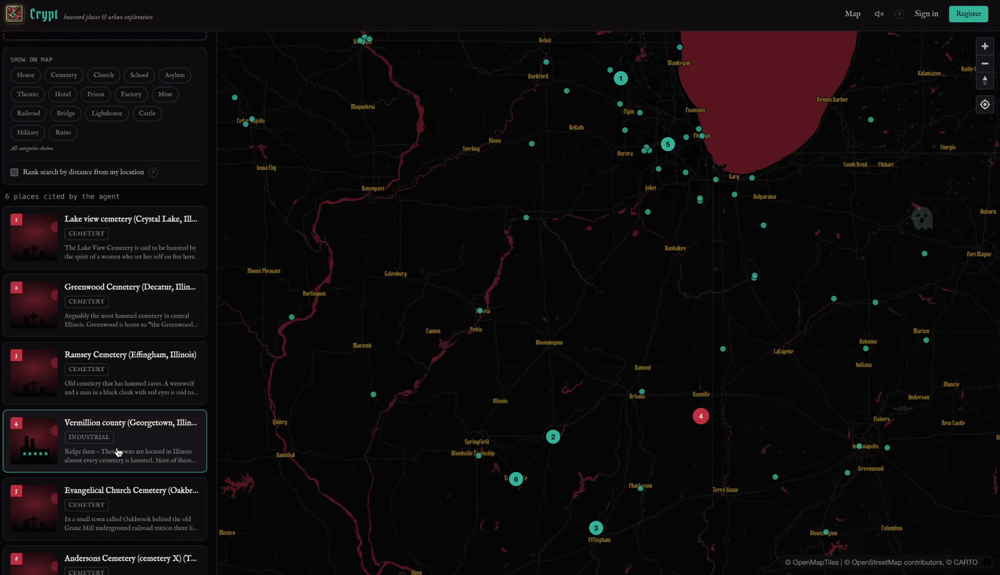
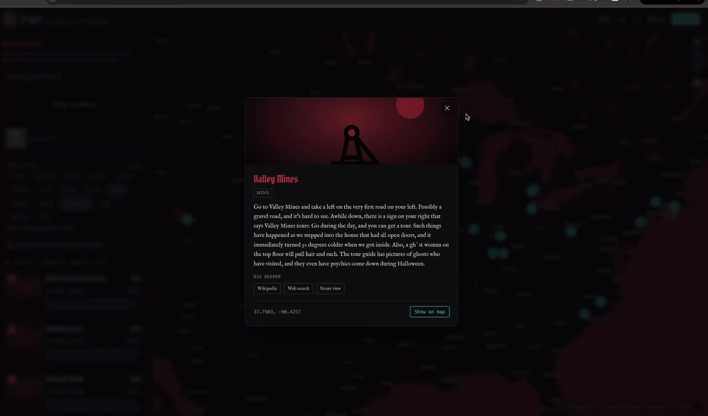
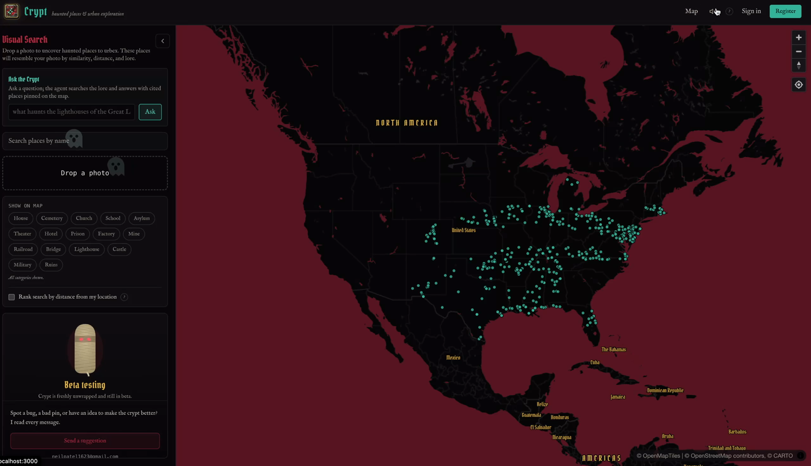
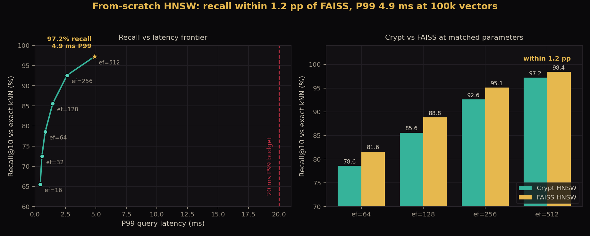

<div align="center">


# Crypt

**Haunted places and urbex, by geospatial visual search.**

Upload a photo and uncover haunted, abandoned, and forgotten places across the
country, ranked by visual similarity, distance, and lore.

[](https://github.com/NeilP211/crypt/actions/workflows/ci.yml)
&nbsp;·&nbsp; Rust · Next.js · PostGIS · CLIP · AWS

<br />


</div>

---


## Ask it questions: hybrid-RAG agent + eval harness

On top of the search platform, [`agent/`](agent/) adds a retrieval-augmented
**agent** over the 10,959-place corpus: a Claude planner that searches a
**hybrid retriever** (dense BGE embeddings + BM25, fused with Reciprocal Rank
Fusion, re-ranked by a cross-encoder), then writes grounded, **`[id]`-cited**
answers. A companion **LLM-judge eval harness** scores retrieval (recall@1
**0.96**, MRR **0.97** over 240 queries) and answer faithfulness, catching
fabrications, location errors, unsupported details, and bad citations. See
[`agent/README.md`](agent/README.md).

## Why

The first rule of urbex is tell no one.
Discovery for haunted spots and urban-exploration sites is gatekept,
scattered across private forums and word of mouth. Crypt is the search engine that takes
a photo and surfaces the eerily similar places, with location, type, and
the story behind each one.

## What it is

A full search platform built around a **vector index written from scratch in
Rust**. The pieces:

- A custom **HNSW** approximate-nearest-neighbor index, the hero component,
  benchmarked against exact kNN.
- **CLIP** embeddings over thousands of haunted/abandoned locations. CLIP is
  multimodal (image and text share one embedding space), so the index can be
  built from location *descriptions* and still answer *photo* queries.
- A **PostGIS** geospatial layer for radius, bounding-box, and distance
  queries.
- **Hybrid ranking** that blends vector similarity, geographic proximity, and
  metadata trust.
- An **axum** backend exposing both REST and gRPC, with JWT auth, Redis
  caching, and Prometheus metrics.
- A **Next.js + MapLibre** map frontend with drag-and-drop image search.
- Full **Terraform** AWS topology and a one-command local stack.

## Screenshots



Ask the Crypt a question and the agent answers with cited places: listed in the
sidebar and pinned on the map (here, haunted cemeteries across Illinois).

| | |
|:--|:--|
|  |  |
| Every place opens a detail card with a category illustration, the recorded haunting, and links to dig deeper. | The Ask box and visual search sit beside the full haunted-places map. |

## Highlights

| | |
|---|---|
| **Custom HNSW index** | recall@10 **97.2%** vs. exact kNN at **100k** vectors |
| **vs. FAISS** | within **1.2 pp** of FAISS HNSW at matched parameters |
| **Query latency** | **P99 4.9 ms** at 100k vectors, far under the 20 ms target |
| **Transports** | REST + gRPC over one shared search core |
| **Ranking** | hybrid vector + geospatial + metadata scoring |
| **Runs locally** | `docker compose up` boots the entire stack |
| **Tested** | 60 automated tests; CI across Rust, Python, web, Terraform, Docker |

Full methodology and the recall-vs-latency frontier:
[`benchmarks/REPORT.md`](benchmarks/REPORT.md).

## Architecture

```
                    ┌──────────────────────────────┐
   photo  ───────►  │  Next.js + MapLibre frontend  │
                    └───────────────┬──────────────┘
                          REST / gRPC │
                    ┌───────────────▼──────────────┐
                    │      crypt-server (axum)      │
                    │  auth · hybrid ranking · cache│
                    └───┬─────────┬─────────┬───────┘
              embed │   │  ANN    │  geo    │ cache
            ┌───────▼─┐ │ ┌───────▼──┐ ┌────▼────┐
            │  CLIP   │ │ │  PostGIS │ │  Redis  │
            │ service │ │ └──────────┘ └─────────┘
            └─────────┘ │
                  ┌─────▼──────┐
                  │ HNSW index │  ◄── built from scratch in Rust
                  └────────────┘
```

A request: photo → CLIP embedding → HNSW candidate lookup → PostGIS hydration
and distance → hybrid re-ranking → cached JSON. See
[`docs/architecture.md`](docs/architecture.md) for the full walkthrough.

## The hero: a from-scratch HNSW index

The `hnsw` crate implements the Hierarchical Navigable Small World algorithm
end to end: the layered proximity graph, the greedy layer descent, the
best-first beam search, and the neighbor-selection heuristic, with **no
third-party ANN dependency**.



Recall is measured against **brute-force exact kNN**, a stricter reference
than comparing two approximate libraries. At 100k clustered 128-d vectors
(modeling CLIP embedding structure), M = 24:

| ef_search | Recall@10 | P50 latency | P99 latency |
|-----------|-----------|-------------|-------------|
| 64        | 78.6%     | 0.6 ms      | 0.8 ms      |
| 128       | 85.6%     | 1.1 ms      | 1.5 ms      |
| 256       | 92.6%     | 2.2 ms      | 2.6 ms      |
| 512       | **97.2%** | 4.2 ms      | **4.9 ms**  |

Against **FAISS HNSW** at identical parameters on the same data, the
from-scratch index lands **within 1.2 percentage points** of recall, detailed in
[`benchmarks/FAISS_COMPARISON.md`](benchmarks/FAISS_COMPARISON.md).

The crate has property tests (retrievability, recall floor, persistence
round-trip), `criterion` micro-benchmarks, and a report generator.

## Tech stack

| Layer | Choice |
|-------|--------|
| Vector index | Custom HNSW in **Rust** |
| Embeddings | **CLIP** ViT-B/32 (`open_clip`) |
| Backend | **Rust**: axum (REST) + tonic (gRPC), sqlx |
| Database | **PostgreSQL + PostGIS** |
| Cache | **Redis** |
| Ingestion | **Python**: OpenStreetMap Overpass API |
| Frontend | **Next.js** + TypeScript + **MapLibre GL JS** |
| Auth | In-house JWT (Argon2id, access + refresh tokens) |
| Observability | OpenTelemetry Collector · Prometheus · Grafana |
| Infrastructure | **Terraform**: ECS Fargate, RDS, S3 + CloudFront |
| CI | GitHub Actions |

## Quickstart

Requires Docker.

```bash
# 1. Boot the whole stack (PostGIS, Redis, backend, embed service,
#    web, OTel Collector, Prometheus, Grafana).
make up

# 2. Load data: download the Haunted Places dataset, embed each location's
#    description with CLIP, build the index. (Downloads the CLIP model and,
#    via the Kaggle CLI, the dataset on first run.)
make ingest
```

Then open:

| URL | What |
|-----|------|
| http://localhost:3000 | Crypt web app |
| http://localhost:8080/api/health | Backend health |
| http://localhost:9090 | Prometheus |
| http://localhost:3001 | Grafana (service-overview dashboard) |

`make ingest` defaults to keeping all of North Carolina and capping other
states (`--boost-state`, `--per-state-cap`). For image-backed places from
OpenStreetMap + Wikidata instead, use `make ingest-osm`.

## Repository layout

```
crypt/
├── crates/
│   ├── hnsw/        from-scratch HNSW index + benchmark harness
│   ├── proto/       gRPC service definitions
│   └── server/      axum REST + gRPC backend
├── ingestion/       Python: OSM scraping, CLIP embedding, PostGIS loading
├── web/             Next.js + MapLibre frontend
├── infra/           Terraform AWS topology
├── deploy/          docker-compose + Dockerfiles
├── observability/   Prometheus, Grafana, OTel Collector configs
├── benchmarks/      recall-vs-latency report + FAISS comparison
└── docs/            architecture notes and ADRs
```

## Development

```bash
make test     # Rust + Python test suites
make lint     # clippy + eslint
make bench    # regenerate the HNSW benchmark report
```

CI runs the Rust suite (fmt, clippy, tests, benchmark smoke), the Python
ingestion tests, the web build, `terraform validate`, and a backend Docker
build on every push.

## Design decisions

Notable trade-offs are recorded as ADRs in [`docs/adr/`](docs/adr/):

1. [Implementing HNSW from scratch](docs/adr/0001-from-scratch-hnsw.md)
2. [MapLibre over Mapbox](docs/adr/0002-maplibre-over-mapbox.md)
3. [In-house authentication](docs/adr/0003-in-house-auth.md)

## About the dataset

Crypt is loaded from the **Shadowlands Haunted Places Index** (via the
[Kaggle dataset](https://www.kaggle.com/datasets/sujaykapadnis/haunted-places)):
~11k reported haunted and abandoned US locations: asylums, cemeteries, old
houses, ghost towns, mills, and ruins, each with coordinates and a written
account of its haunting. The ingestion pipeline also supports OpenStreetMap and
Wikidata sources (`--wikidata`) for image-backed places worldwide.

**Why a photo can search text.** The haunted dataset has descriptions, not
photos. Because CLIP encodes images and text into the *same* embedding space,
Crypt embeds each location's caption with CLIP's text encoder and your uploaded
photo with its image encoder, and compares them directly. The HNSW
index, PostGIS layer, and hybrid ranking are all unchanged.


## Design

The visual identity (the candle icon, the teal / crimson / gold palette, and
the gothic type) is inspired by the **Crypt Candle**, an item from the game
Albion Online. It used to be my favorite offhand item, and it looks really cool and matches the theme.

## Notes

The AWS Terraform in `infra/` is real and `terraform validate`-clean, but is
not applied by this project: deploying it needs an AWS account and incurs
cost. Everything else runs locally with `docker compose`.

## License

MIT
