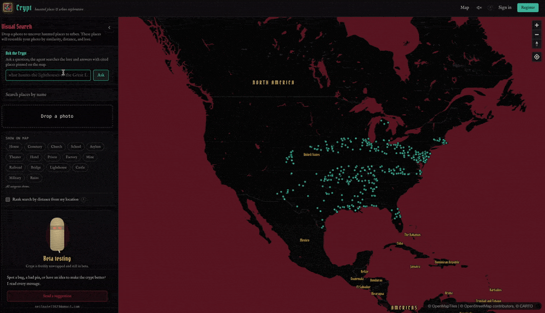

# Crypt Agent: hybrid-RAG question answering + an LLM-judge eval harness

A retrieval-augmented agent that answers questions about real haunted and
abandoned places, layered on top of Crypt's corpus. It pairs a modern hybrid
retrieval stack with a tool-using planner and a faithfulness eval harness, so
every answer is grounded in retrieved evidence and the whole pipeline is
measured, not vibes.



## What it does

```
question
   |
   v
planner agent (Claude, tool use) --search_places--> hybrid retriever
   |                              --get_place------>   dense (BGE) + sparse (BM25)
   v                                                   -> Reciprocal Rank Fusion
grounded, cited answer  <-- evidence --                -> cross-encoder rerank
   |
   v
LLM-judge eval: faithfulness + hallucination catch-rate
```

- **Corpus:** 10,959 real US haunted/abandoned places (Shadowlands Haunted
  Places dataset), each with lore text, location, and a structure type.
- **Hybrid retrieval:** dense `BAAI/bge-small-en-v1.5` embeddings + BM25,
  fused with **Reciprocal Rank Fusion**, then re-ordered by a
  `ms-marco-MiniLM` **cross-encoder reranker**. Metadata (state, structure
  type) and geo filters are applied before fusion.
- **Agent:** a planner that calls `search_places` / `get_place`, then writes a
  concise answer with `[id]` citations. Every answer is checked: a citation to
  a place the agent never retrieved is flagged as ungrounded.
- **Eval harness:** retrieval metrics (recall@k, MRR) plus an **LLM judge**
  that scores answer faithfulness across four failure modes (fabrication,
  location error, unsupported detail, citation mismatch) and reports how often
  it catches injected hallucinations.

## Results

Retrieval, over 240 held-out queries (entity + lore), measured by
`crypt-agent eval`:

| metric | value |
|---|---|
| recall@1 | **0.96** |
| recall@5 | **0.99** |
| recall@10 | **1.00** |
| MRR | **0.97** |

The LLM-judge faithfulness numbers (hallucination catch-rate and
false-positive rate on grounded answers) are produced by the same `eval`
command once `ANTHROPIC_API_KEY` is set.

## Run it

```bash
python -m venv .venv && .venv/bin/pip install -e .
python -m crypt_agent.cli build-corpus          # real data from Kaggle
python -m crypt_agent.cli search "abandoned asylum" --state Ohio
export ANTHROPIC_API_KEY=sk-ant-...              # for the agent + judge
python -m crypt_agent.cli ask "what haunts the lighthouses of the Outer Banks?"
python -m crypt_agent.cli eval                   # retrieval + judge metrics
```

Retrieval, the corpus builder, and the eval's retrieval half run with no API
key. The agent and the judge need a key; the design is provider-agnostic
behind `llm.py`.

## Layout

```
crypt_agent/
  corpus.py      real-data corpus builder (Haunted Places -> corpus.jsonl)
  retrieval.py   dense + BM25 + RRF + cross-encoder reranker
  llm.py         Anthropic client wrapper (single seam, swappable)
  tools.py       search_places / get_place tool schemas + dispatch
  agent.py       tool-use planner loop, cited + grounded answers
  evals/         dataset (deterministic) + judge + metric runner
tests/           offline suite (fake LLM, monkeypatched encoders)
```

Tests run fully offline: `python -m pytest`.
